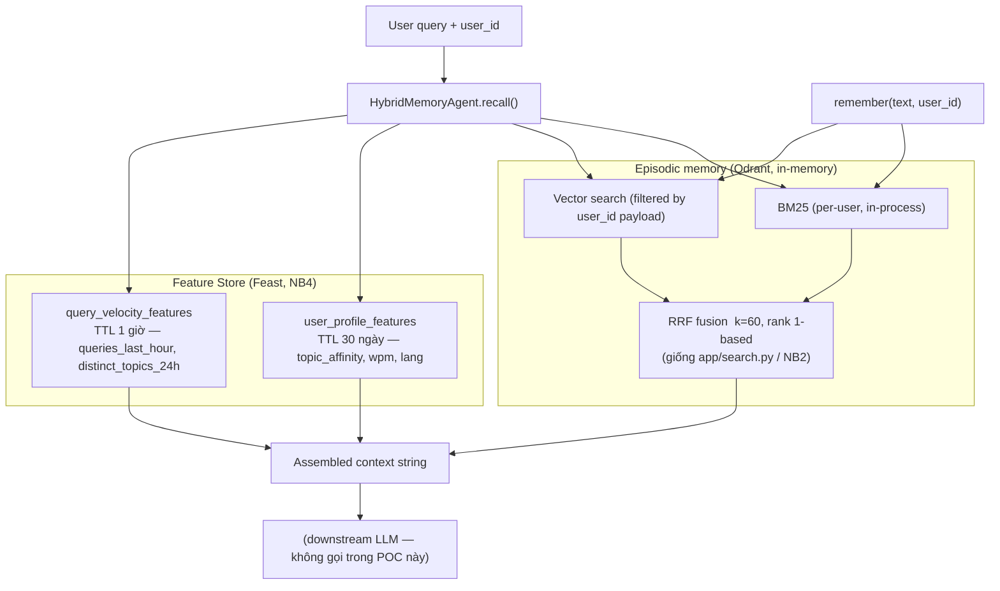

# Bonus — Hybrid Memory Agent: Vector Store + Feature Store

**Tác giả:** Cao Minh Quang (solo, không pair).

Đề bài: trợ lý AI cá nhân cho người dùng Việt Nam cần nhớ 3 loại thứ —
episodic memory (Vector Store), stable profile (Feature Store), và recent
activity (feature TTL ngắn). POC này build `HybridMemoryAgent` (`bonus/agent.py`)
không phải như một hệ thống mới, mà như dây nối hai nửa **đã có sẵn** của
Lab 19: RRF hybrid search từ NB2/`app/search.py`, và 3 feature views đã
`apply` + `materialize` ở NB4 (`app/feast_repo`).

## 1. Sơ đồ kiến trúc

`remember()` ghi thẳng vào Qdrant (episodic, ghi liên tục). `recall()` đọc
song song 2 nguồn — Qdrant (RRF hybrid, filter theo `user_id`) và Feast
online store (profile + activity) — rồi ghép thành 1 context string. Không
có bước LLM thật trong POC, đúng như brief yêu cầu.

## 2. Ba quyết định kiến trúc

### Quyết định 1 — Chunking: per-message, không semantic-split

Chọn: mỗi lần gọi `remember(text)` là **một chunk**, không tự động cắt câu
dài. Cân nhắc: *retrieval quality vs storage cost vs context window*. Với
ghi chú/tin nhắn ngắn (< 50 từ, giống corpus lab), per-message giữ mỗi
vector "thuần" một ý — recall chính xác, dễ trace nguồn (mỗi memory trả về
đúng câu gốc). Nhược điểm thật: nếu user paste nguyên một bài báo dài,
một vector duy nhất sẽ loãng semantic signal (giống bài học NB1: embed
`title + text` gộp đã đủ tốt cho doc ngắn ~100 từ, nhưng sẽ tệ dần nếu text
dài hơn nhiều). POC hiện **chưa** có ngưỡng tự động chuyển sang paragraph-
split khi text vượt ~200 từ — ghi nhận ở mục Giới hạn bên dưới.

### Quyết định 2 — Feature schema: tái dùng tabular features của NB4, không tạo embedding feature

Chọn: dùng nguyên `user_profile_features` (reading_speed_wpm,
preferred_language, topic_affinity) + `query_velocity_features`
(queries_last_hour, distinct_topics_24h) đã định nghĩa ở NB4, thay vì thiết
kế feature schema riêng cho bonus. Lý do chọn **tabular** thay vì
**embedding feature** (latent preference vector học từ lịch sử): với ~5
trường scalar, tabular dễ debug, dễ giải thích cho người dùng ("vì bạn
thích cloud" — audit được), còn embedding feature đòi hỏi đủ lịch sử tương
tác mới ổn định (cold-start cho user mới, giống vấn đề NB1 gặp với embedding
model yếu trên câu paraphrase ít dữ liệu). Đánh đổi: mất khả năng bắt sở
thích tinh vi/ngầm (ví dụ user thích "AI ứng dụng trong y tế" chứ không chỉ
"ai_ml" nói chung) — tabular chỉ có 5 topic rời rạc.

### Quyết định 3 — Freshness: 3 mức khác nhau cho 3 loại dữ liệu

Câu hỏi "trợ lý nhớ gì về tôi?" cần độ tươi khác nhau tuỳ loại dữ liệu:

| Loại dữ liệu | Độ tươi cần | Cơ chế |
|---|---|---|
| Episodic (vừa đọc xong 1 tài liệu) | Sub-second | `remember()` ghi thẳng Qdrant tại thời điểm gọi — không qua batch, giống bài viết chèn document là index ngay |
| `topic_affinity` (sở thích dài hạn) | Không cần realtime — batch hàng ngày/tuần đủ | TTL 30 ngày như NB4 `user_profile_features` — sở thích không đổi theo phút |
| `queries_last_hour` (hoạt động gần đây) | 5–15 phút | `materialize-incremental` chạy định kỳ + TTL 1 giờ như NB4 `query_velocity_features` — TTL dài hơn sẽ báo "đang hỏi nhiều" dù user đã offline lâu (đúng bài học TTL ở NB4 §Vibe-coding callout) |

`materialize-incremental` bên dưới vẫn là **point-in-time join** (đúng cơ
chế NB4 §6 dùng cho `get_historical_features`) — mỗi entity lấy giá trị
feature tại đúng thời điểm request, không lấy nhầm giá trị "mới nhất nhưng
đến sau" (bug đã tự gặp và sửa ở NB4 khi PIT join ban đầu chỉ trả 2/3
dòng). Nếu cần độ tươi dưới 5 phút cho `queries_last_hour` ở quy mô
production thật, bước tiếp theo hợp lý là thay `materialize-incremental`
định kỳ bằng một **streaming feature view** (Feast Push API) — batch
materialize không bao giờ đạt sub-second, chỉ streaming mới đạt được.

## 3. Lựa chọn bị loại bỏ

**Tôi xem xét** lưu episodic memory làm một on-demand feature view trong
Feast (giống `amount_vs_avg` ở NB8) **nhưng chọn** tách hẳn sang Qdrant
riêng, **vì**: (1) re-index cycle khác hẳn nhau — memory mới đến liên tục
theo từng tin nhắn, còn feature view materialize theo lịch batch/TTL cố
định, gộp chung sẽ buộc episodic phải chờ chu kỳ materialize mới xuất hiện,
phá mất mục tiêu sub-second ở Quyết định 3; (2) Feast online store chỉ hỗ
trợ lookup theo entity key (giống `get_online_features`), **không có ANN
similarity search** — thứ bắt buộc phải có để trả lời "top-3 memory liên
quan nhất" cho một câu hỏi tự do.

## 4. Vietnamese-context considerations

- **Tokenizer cho BM25:** dùng whitespace split y hệt `app/search.py` —
  chấp nhận baseline yếu cho từ ghép tiếng Việt (vd. "trí tuệ nhân tạo" bị
  tách 3 token rời thay vì 1 khái niệm). Production nên chạy qua
  `pyvi`/`underthesea` word-segmentation trước khi tokenize; lab giữ đơn
  giản để không thêm dependency nặng, đánh đổi lấy recall BM25 thấp hơn.
- **Code-switching (vi/en mix):** câu hỏi thật của người Việt hay trộn
  "recommend đọc gì tiếp" — embedding model `bge-small-en-v1.5` (train
  tiếng Anh) đã được đo ở NB2 là yếu với truy vấn paraphrase thuần tiếng
  Việt (recall 24–32%). Với agent nhớ lâu dài thật, nên đổi sang `bge-m3`
  (multilingual, path Docker) như README đã khuyến nghị.
- **Privacy / Nghị định 13/2023 (bảo vệ dữ liệu cá nhân):** episodic memory
  là dữ liệu cá nhân nhạy cảm (nội dung user đọc, nghĩ). Cách ly hiện tại
  chỉ dựa vào payload filter `user_id` trong Qdrant — đúng bài học "rò
  chéo tenant" ở NB7: đây là **soft isolation**, quên một filter là rò
  toàn bộ. POC này chưa có encryption at rest hay per-user collection.

## 5. Giới hạn thật (honest limitations)

POC này **chưa** xử lý: encryption at rest cho episodic memory; CRUD thật
(xoá/sửa một memory cụ thể — hiện chỉ có insert); multi-device sync; memory
decay/TTL cho episodic (memory sống mãi mãi trong demo, không có cơ chế
"archive sau 30 ngày không truy cập" như gợi ý mở rộng); chunking tự động
cho văn bản dài; và privacy isolation vẫn là soft filter chứ không phải
hard multi-tenancy (per-user collection hoặc encryption theo key riêng).

## 6. Vibe-coding note

Prompt hiệu quả nhất: yêu cầu AI viết lại đúng công thức RRF đã có ở
`app/search.py` cho phần fusion trong `agent.py` — vì đã có spec + code
tham chiếu rõ ràng, AI viết đúng ngay lần đầu, không cần sửa. Prompt kém
hiệu quả: hỏi AI "thiết kế embedding feature cho user profile" khi mới
brainstorm — AI đề xuất train một mô hình collaborative-filtering riêng,
vượt xa scope 4–6 giờ của bonus; phải tự giới hạn lại thành "chỉ tái dùng
feature có sẵn từ NB4" (Quyết định 2 ở trên) rồi mới prompt lại.
